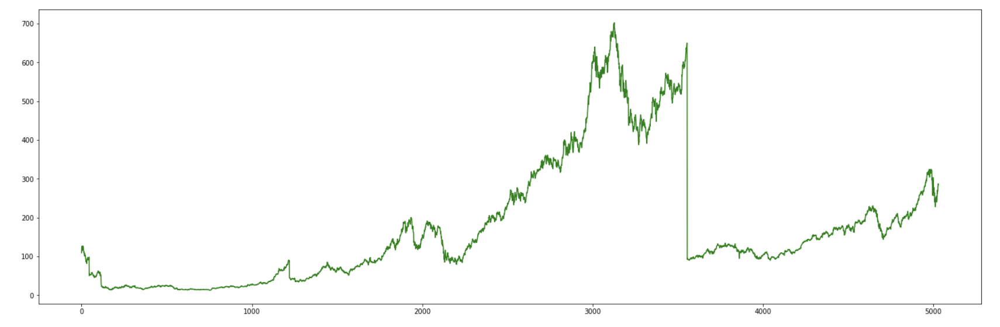
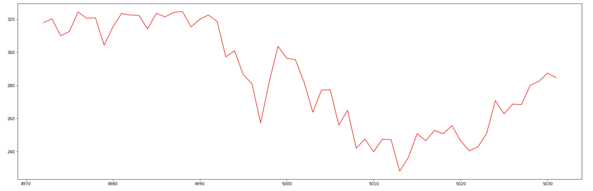
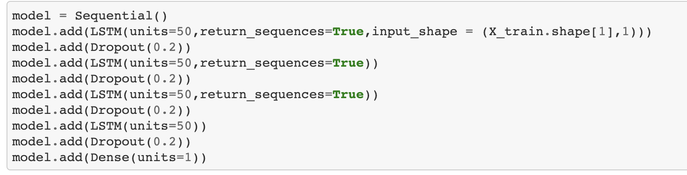
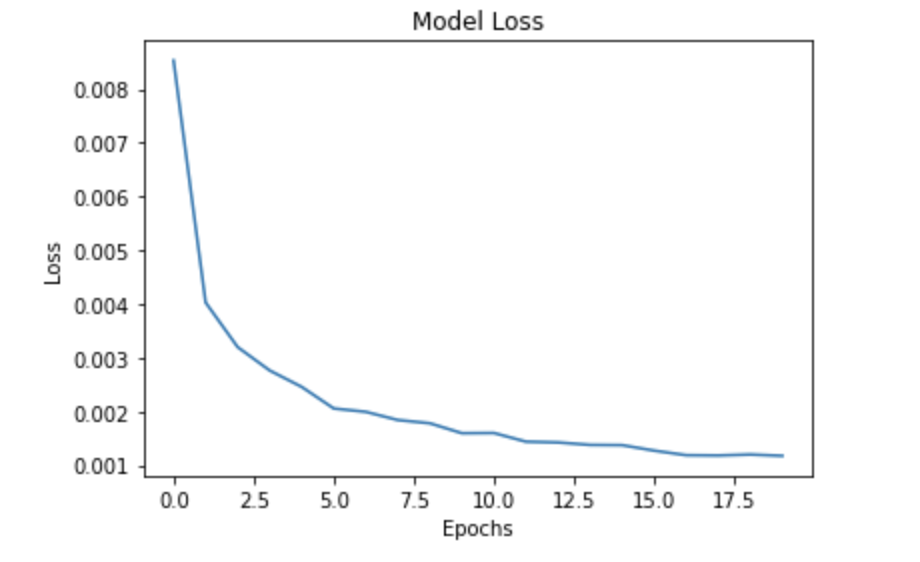
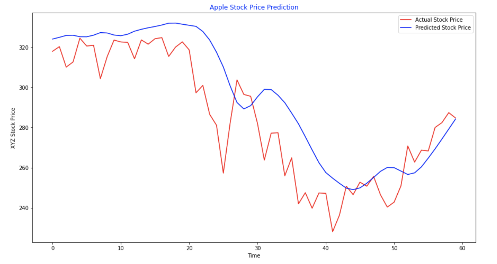

# Stock Trends Prediction using LSTM.

**Here we have taken the historical data of Apple stocks from Alpha-Vantage API to predict the trends using LSTM** 

**Apple stock trends over the years**

**Below is the trend in last 60 Days which we are trying to predict**

**Model Architecture**

**Model Loss across epochs**

**Actual vs Predicted Comparison**

We are able to predict the trend of stocks whether it is going upward or downward in the coming days

  
The RNN we built was a regressor. Indeed, we were dealing with Regression because we were trying to predict a continuous outcome \(the Apple Stock Price\). For Regression, the way to evaluate the model performance is with a metric called RMSE \(Root Mean Squared Error\). It is calculated as the root of the mean of the squared differences between the predictions and the real values.

However for our specific Stock Price Prediction problem, evaluating the model with the RMSE does not make much sense, since we are more interested in the directions taken by our predictions, rather than the closeness of their values to the real stock price. We want to check if our predictions follow the same directions as the real stock price and we don’t really care whether our predictions are close the real stock price. The predictions could indeed be close but often taking the opposite direction from the real stock price.

[Please find here from complete code Implementation](https://github.com/ikyath/RNN_Introduction_Fundamentals/blob/master/StockPrediction_LSTM.ipynb).

