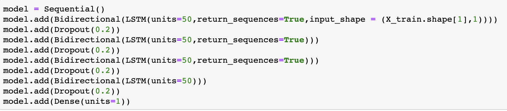
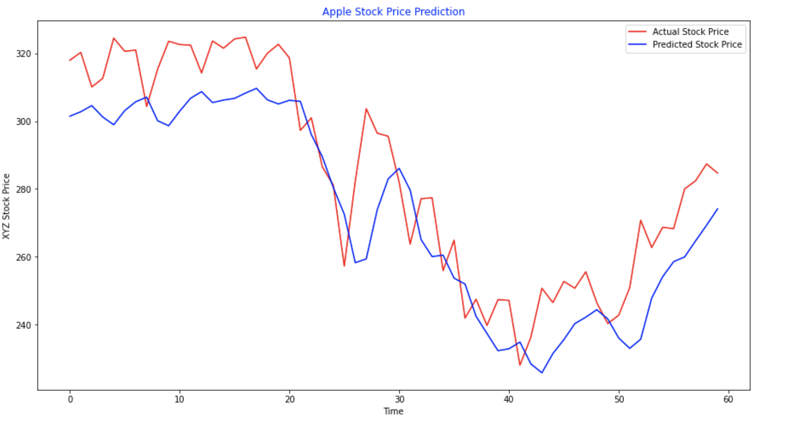

# Stock Trends Prediction using Bidirectional RNNs

For the same problem mentioned in LSTM Example, lets try to predict the prices using Bidirectional LSTM



Model Architecture of Bidirectional RNN

Below is the Actual vs Predicted trend in Apple Stock Prices using Bidirectional RNN

From the above graph, it is evident how closely we are able to predict the trend in the stocks using Bidirectional LSTM.

[Please find here from complete code Implementation](https://github.com/ikyath/RNN_Introduction_Fundamentals/blob/master/StockPrediction_Bidirectional.ipynb).

