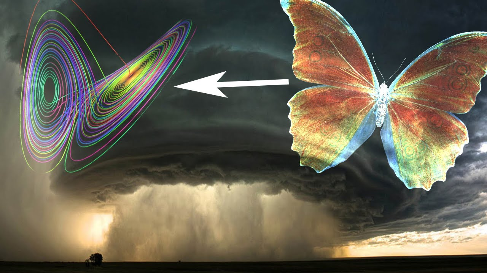

# Forecasting

One of the central questions in science is forecasting: given the past history, how well can we predict the future? In many domains with complex multi-variate correlation structures and nonlinear dynamics, forecasting is highly challenging since the system has long-term temporal dependencies and higher-order dynamics. Examples of such systems abound in science and engineering, from biological neural network activity, fluid turbulence, to climate and traffic systems. 

This means that even if we have the exact deterministic equations to describe a weather system, our forecast will still become more and more incorrect.

The further into the future we try to predict, that's pretty counterintuitive, because you would think if you have the exact equation for something then you should be able to calculate all the future values precisely but due to the butterfly effect this is not actually true.

As the saying goes, 

> A butterfly flapping its wings in Tokyo can cause a tornado in America.

Make small decisions like numerical round off error and your computer will ultimately lead to your weather forecast being completely wrong eventually.

Lets us start learning about RNNs by initially understanding why do we need an RNN

